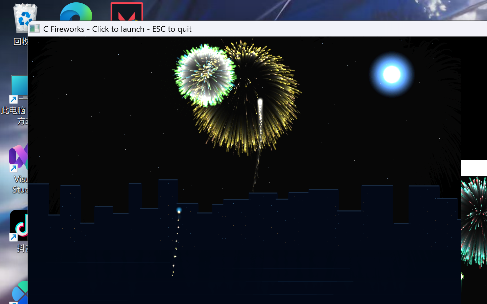

# 我的第一个仓库🎇
欢迎来到Github学习空间🍳！！！
这里用来编辑我的学习过程，主要存放C语言，python，Java练习代码，小项目与学习笔记🧑‍💻
持续学习，不断积累，一步一步提升自己的编程能力🛫

## 坦克大战 · 霓虹漂移版

主要文件：`tank_battle_ultra_drift.py`

这是一个 Python + Pygame 制作的雨夜霓虹城市坦克游戏，支持惯性漂移、轮胎印、动态镜头、无限地图、道具升级和 Boss 战。

### 下载游戏

1. 打开仓库首页。
2. 点击绿色的 `Code` 按钮。
3. 选择 `Download ZIP`。
4. 解压下载的压缩包。

### 安装并运行

在解压后的文件夹中打开终端，执行：

```powershell
pip install -r requirements.txt
python tank_battle_ultra_drift.py
```

Python 3.14 用户建议直接使用上面的 `pygame-ce` 依赖，不需要单独安装普通 Pygame。

### 操作方式

- `WASD` 或方向键：移动
- 鼠标：瞄准
- 鼠标左键：机枪
- `空格`：重炮
- `Shift`：手刹漂移
- `ESC`：暂停
- `R`：重新开始

提示：如果中文输入法导致 `WASD` 无法移动，请切换到英文输入法，或者直接使用方向键。

### 游戏预览


## C语言烟花特效

主要文件：`fireworks.c`

这是一个使用 Windows 原生 API 编写的 C 语言烟花程序，不需要安装 SDL 或 OpenGL。

### 编译和运行

Windows 用户可以双击：

```text
build_fireworks.bat
```

也可以使用 GCC 手动编译：

```powershell
gcc fireworks.c -O2 -std=c11 -o fireworks.exe -lgdi32 -luser32 -lm -mwindows
```

### 操作方式

- 鼠标左键：在鼠标位置发射烟花
- `空格`：同时发射三枚烟花
- `ESC`：退出

### 烟花预览


## C语言数学工具箱

包含普通计算器、素数、水仙花数、最大公约数和斐波那契数列。

项目目录：[`math_toolbox`](math_toolbox)

运行文件：`math_toolbox/math_toolbox.exe`


## Java Swing 贪吃蛇

项目目录：[`snake_game_java`](snake_game_java)

主要文件：`snake_game_java/SnakeGame.java`

这是一个用纯 Java Swing 编写的贪吃蛇游戏，不依赖任何第三方库，需要 JDK 17 或更高版本。支持转向缓冲队列、逐步加速、暂停与重开，并记录本次运行的最高分。

### 编译和运行

Windows 用户可以双击：

```text
snake_game_java/build_snake_game.bat
```

也可以使用 JDK 手动编译：

```powershell
javac -encoding UTF-8 -d out SnakeGame.java
java -cp out SnakeGame
```

### 操作方式

- 方向键 / `WASD`：移动
- `空格`：开始 / 暂停
- `回车`：重新开始
- 鼠标点击：开始 / 暂停 / 重开

提示：代码里已经调用 `enableInputMethods(false)` 关闭了输入法，所以中文输入法下 `WASD` 也能正常转向，不需要像坦克大战那样手动切换到英文输入法。
