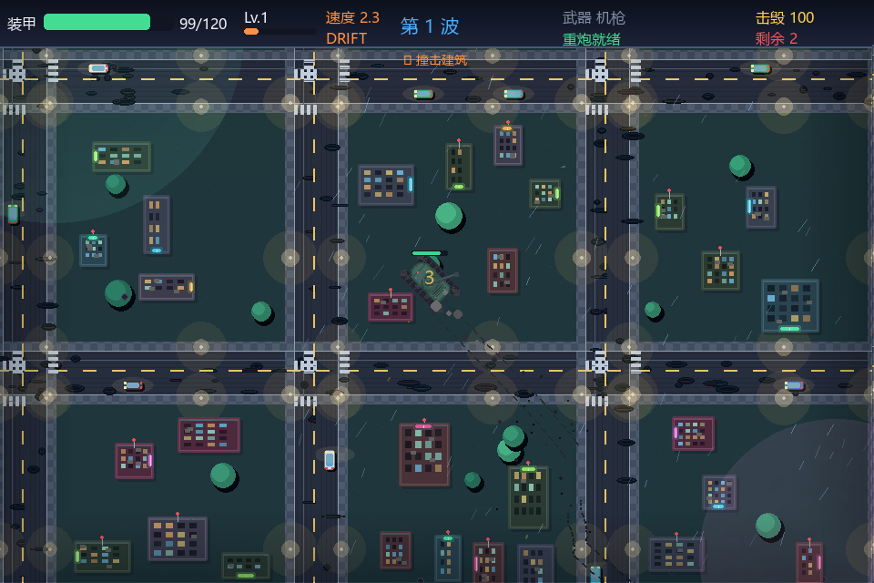

# 我的第一个仓库🎇
欢迎来到Github学习空间🍳！！！
这里用来编辑我的学习过程，主要存放C语言，python练习代码，小项目与学习笔记🧑‍💻
持续学习，不断积累，一步一步提升自己的编程能力🛫

## 坦克大战 · 霓虹漂移版

主要文件：`tank_battle_ultra_drift.py`

这是一个 Python + Pygame 制作的雨夜霓虹城市坦克游戏，支持惯性漂移、轮胎印、动态镜头、无限地图、道具升级和 Boss 战。

### 下载游戏

1. 打开仓库首页。
2. 点击绿色的 `Code` 按钮。
3. 选择 `Download ZIP`。
4. 解压下载的压缩包。

### 安装并运行

在解压后的文件夹中打开终端，执行：

```powershell
pip install -r requirements.txt
python tank_battle_ultra_drift.py
```

Python 3.14 用户建议直接使用上面的 `pygame-ce` 依赖，不需要单独安装普通 Pygame。

### 操作方式

- `WASD` 或方向键：移动
- 鼠标：瞄准
- 鼠标左键：机枪
- `空格`：重炮
- `Shift`：手刹漂移
- `ESC`：暂停
- `R`：重新开始

提示：如果中文输入法导致 `WASD` 无法移动，请切换到英文输入法，或者直接使用方向键。

### 游戏预览


