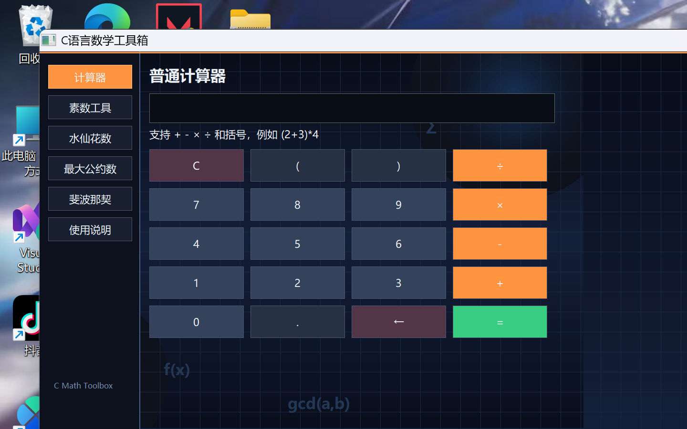
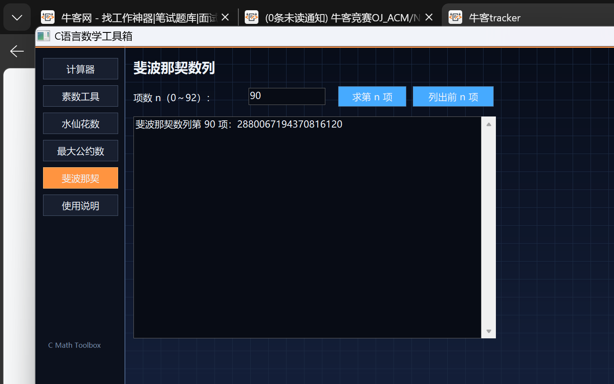

# C语言数学工具箱

一个使用纯 Win32 API 和 C11 编写的 Windows 数学工具，不需要第三方图形库。

## 功能

- 普通计算器：支持加减乘除、括号和运算优先级
- 素数工具：判断素数、列出指定范围内的素数
- 水仙花数：默认计算 100～999，也可以自定义范围
- 最大公约数与最小公倍数
- 斐波那契数列：支持第 n 项和前 n 项

## 运行

直接双击 `math_toolbox.exe`。

## 重新编译

在 Windows 上双击 `build_math_toolbox.bat`，或者使用：

```powershell
gcc math_toolbox.c -O2 -std=c11 -municode -mwindows -o math_toolbox.exe -lgdi32 -luser32
```

## 界面预览



